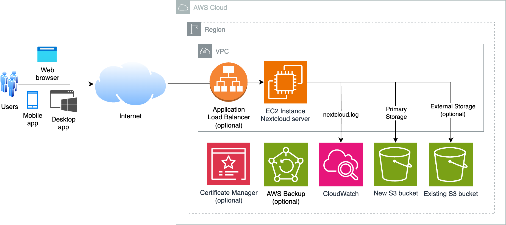

# nextcloud-server
[AWS CloudFormation](https://aws.amazon.com/cloudformation/) template that provisions an EC2 instance running Nextcloud file synchronization and sharing server, with [Amazon S3](https://aws.amazon.com/s3/) as primary storage and [AWS Backup](https://aws.amazon.com/s3/) for data protection.

## Notice
Although this repository is released under the [MIT-0](LICENSE) license, its CloudFormation template uses features from [Nextcloud](https://github.com/nextcloud/server) project. Nextcloud project's licensing includes the [AGPL](https://github.com/nextcloud/server?tab=AGPL-3.0-1-ov-file) license.

The template offers the option to install [Webmin](https://github.com/webmin/webmin) which is licensed under [BSD-3-Clause](https://github.com/webmin/webmin?tab=BSD-3-Clause-1-ov-file) license. 

Usage of template indicates acceptance of license agreements of all software that is installed in the EC2 instance. 


## Architecture diagram



## Deployment via CloudFormation console
Download [UbuntuLinux-Nextcloud.yaml](UbuntuLinux-Nextcloud.yaml) file, and login to AWS [CloudFormation console](https://console.aws.amazon.com/cloudformation/home#/stacks/create/template). Choose **Create Stack**, **Upload a template file**, **Choose File**, select your .yaml file and choose **Next**. Enter a **Stack name** and specify parameters values.

### Parameter options
EC2 instance
- `ec2Name`: EC2 instance name 
- `ec2KeyPair`: [EC2 key pair](https://docs.aws.amazon.com/AWSEC2/latest/UserGuide/ec2-key-pairs.html) name. [Create key pair](https://docs.aws.amazon.com/AWSEC2/latest/UserGuide/create-key-pairs.html) if necessary
- `osVersion`: Operating System version and processor architecture. Default architecture is [Graviton](https://aws.amazon.com/ec2/graviton/) arm64
- `instanceType`: EC2 [instance type](https://aws.amazon.com/ec2/instance-types/). Do ensure type matches processor architecture. Default is `t4g.medium` [burstable instance type](https://aws.amazon.com/ec2/instance-types/t4/). For best performance, consider [M6g](https://aws.amazon.com/ec2/instance-types/m6g/) or [M7g](https://aws.amazon.com/ec2/instance-types/m7g/) for general purpose workloads

Network
- `vpcID`: [VPC](https://docs.aws.amazon.com/vpc/latest/userguide/what-is-amazon-vpc.html) with internet connectivity. Select [default VPC](https://docs.aws.amazon.com/vpc/latest/userguide/default-vpc.html) if unsure
- `subnetID`: subnet with internet connectivity. Select subnet in default VPC if unsure
- `displayPublicIP`: set this to `No` if your EC2 instance will not receive [public IP address](https://docs.aws.amazon.com/AWSEC2/latest/UserGuide/using-instance-addressing.html#concepts-public-addresses). EC2 private IP will be displayed in CloudFormation Outputs section instead. Default is `Yes`
- `assignStaticIP`: associates a static public IPv4 address using [Elastic IP address](https://docs.aws.amazon.com/AWSEC2/latest/UserGuide/elastic-ip-addresses-eip.html). Default is `Yes`

Remote Administration
- `ingressIPv4`: allowed IPv4 internet source prefix to SSH, e.g. `1.2.3.4/32`. You can get your source IP from [https://checkip.amazonaws.com](https://checkip.amazonaws.com). Use `127.0.0.1/32` to block incoming access from public internet. Default is `0.0.0.0/0`. 
- `ingressIPv6`: allowed IPv6 internet source prefix to SSH. Use `::1/128` to block all incoming IPv6 access. Default is `::/0`
- `installDCV`: install graphical desktop environment and [NICE DCV](https://aws.amazon.com/hpc/dcv/) server. Default is `No`
- `installWebmin`: install [Webmin](https://webmin.com/) web-based system administration tool. Default is `No`
- `allowSSHport`: allow inbound SSH from `ingressIPv4` and `ingressIPv6`. Option does not affect [EC2 Instance Connect](https://aws.amazon.com/blogs/compute/new-using-amazon-ec2-instance-connect-for-ssh-access-to-your-ec2-instances/) access. Default is `Yes`


Nextcloud options
- `adminUserName`: Nextcloud admin username. Default is `admin`
- `phpVersion`: PHP version to install. Uses [ppa:ondrej/php](https://launchpad.net/~ondrej/+archive/ubuntu/php/) PPA 
- `databaseOption`: `MariaDB` or `MySQL`. Default is `MariaDB`
- `s3StorageClass`: [S3 storage class](https://docs.aws.amazon.com/AmazonS3/latest/userguide/storage-class-intro.html) to associate uploaded file with. Default is `STANDARD`

EBS
- `volumeSize`: [Amazon EBS](https://docs.aws.amazon.com/AWSEC2/latest/UserGuide/AmazonEBS.html) volume size
- `volumeType`: [EBS General Purpose Volume](https://aws.amazon.com/ebs/general-purpose/) type

AWS Backup
- `backupResource`: backup EC2 instance, S3 bucket, both or none. Default is `EC2-and-S3` 
- `scheduleExpression`: CRON expression specifying when AWS Backup initiates a backup job. Default is `cron(0 1 ? * * *)`
- `scheduleExpressionTimezone`: timezone in which the schedule expression is set. Default is `Etc/UTC`
- `deleteAfterDays`: number of days after creation that a recovery point is deleted. Default is `7` days


It may take more than 30 minutes to provision the entire stack. After your stack has been successfully created, its status changes to **CREATE_COMPLETE**.


### CloudFormation Outputs
The following are available in **Outputs** section 

- `DCVwebConsole` (if `installDCV` is `Yes`): NICE DCV web browser console URL link. Login as user specified in *Description* field. 
- `EC2console`: EC2 console URL link to your EC2 instance
- `EC2instanceConnect`: [EC2 Instance Connect](https://aws.amazon.com/blogs/compute/new-using-amazon-ec2-instance-connect-for-ssh-access-to-your-ec2-instances/) URL link. Functionality is only available under [certain conditions](https://docs.aws.amazon.com/AWSEC2/latest/UserGuide/ec2-instance-connect-prerequisites.html)
- `SetPasswordCmd`: command to set Nextcloud admin password
- `SSMsessionManager` or `SSMsessionManagerDCV`: [SSM Session Manager](https://aws.amazon.com/blogs/aws/new-session-manager/) URL link
- `WebminUrl` (if `installWebmin` is `Yes`): Webmin URL link. Set the root password by running `sudo passwd root` using `EC2instanceConnect`, `SSMsessionManager` or SSH session first
- `WebUrl`: EC2 web server URL link

### Nextcloud admin user password
Use either EC2 instance connect or SSM session manager URL link to obtain in-browser terminal access to your EC2 instance. Copy and paste `SetPasswordCmd` value to set Nextcloud admin password. For example, if `adminUserName` value is `admin`, the command is

```
sudo -u www-data php /var/www/html/occ user:resetpassword admin
```
After which, you can login to your Nextcloud application using `WebUrl` link or proceed to install a HTTPS certificate.


## Obtaining certificate for HTTPS using Certbot 
The EC2 instance uses a self-signed certificate for HTTPS. You can use [Certbot](https://certbot.eff.org/pages/about) to automatically obtain and install [Let's Encrypt](https://letsencrypt.org/) certificate on your web server.

### Prerequisites
Ensure you have a domain name whose DNS entry resolves to your EC2 instance public IP address. If you do not have one, you can [register a new domain](https://docs.aws.amazon.com/Route53/latest/DeveloperGuide/domain-register.html#domain-register-procedure-section) and [create a DNS A record](https://docs.aws.amazon.com/Route53/latest/DeveloperGuide/resource-record-sets-creating.html) with [Amazon Route 53](https://aws.amazon.com/route53/).


### Verify DNS record
From EC2 terminal session, run the following command to determine its public IPv4 address
```
curl checkip.amazonaws.com
```

Assuming your domain name is `nextcloud.example.com`, run the following command to verify IP address associated with it
```
dig +short nextcloud.example.com
```

Ensure that both commands return the same IP address


### Using Certbot 
From terminal, run the below command
```
sudo certbot --apache
```
Follow instructions to have certbot request and install certificate on your Apache web server. Open a browser to your website to verify that TLS certificate is properly installed. 

### Configure HSTS
To configure [HTTP Strict Transport Security (HSTS)](https://en.wikipedia.org/wiki/HTTP_Strict_Transport_Security), edit `*ssl.conf` file in `/etc/apache2/sites-available/` folder and add the following text between `<VirtualHost>` and `</VirtualHost>` rows.

```
    <IfModule mod_headers.c>
      Header always set Strict-Transport-Security "max-age=15552000; includeSubDomains"
    </IfModule>
```
Reload Apache server
```
sudo systemctl reload apache2
```

## About Nextcloud on AWS

### Sending email
Nextcloud supports [email server](https://docs.nextcloud.com/server/latest/admin_manual/configuration_server/email_configuration.html) for password reset and activity notifications. You can configure Nextcloud to use [external SMTP server](https://docs.nextcloud.com/server/latest/admin_manual/configuration_server/email_configuration.html#configuring-an-smtp-server) or [sendmail](https://docs.nextcloud.com/server/latest/admin_manual/configuration_server/email_configuration.html#configuring-sendmail-qmail).

When configuring external SMTP server, use 465, 587 or any port number that your server supports that is not 25. Amazon EC2 [restricts](https://docs.aws.amazon.com/AWSEC2/latest/UserGuide/ec2-resource-limits.html#port-25-throttle) email sending using port 25 on all instances by default. You can request that this restriction be removed. Refer to [How do I remove the restriction on port 25 from my Amazon EC2 instance or Lambda function?](https://repost.aws/knowledge-center/ec2-port-25-throttle) for more information.

### Mounting another S3 bucket
Nextcloud [external storage](https://docs.nextcloud.com/server/latest/admin_manual/configuration_files/external_storage_configuration_gui.html) feature enables you to mount external storage services including existing S3 buckets as secondary storage devices. Refer to [NextCloud documentation](https://docs.nextcloud.com/server/latest/admin_manual/configuration_files/external_storage/amazons3.html) for details.


### Using Nextcloud
Refer to Nextcloud [documentation site](https://docs.nextcloud.com/)


## Data protection

### Cloudformation termination protection
To prevent your CloudFormation stack resources from accidental deletion, you can enable termination protection. Refer to [Protecting a stack from being deleted](https://docs.aws.amazon.com/AWSCloudFormation/latest/UserGuide/using-cfn-protect-stacks.html) for instructions.

### Filter IAM policy source IP
As Nextcloud does not support instance profile, the CloudFormation template creates an [IAM user](https://docs.aws.amazon.com/IAM/latest/UserGuide/id_users.html) with programmatic access to S3 bucket.  If `assignStaticIP` is `Yes`, you can limit access key use to requests made by your Nextcloud server.

The created user name can be located in CloudFormation **Resources** section with `Logical ID` of **iamUser**. Click on the `Physical ID` value to view IAM user permission in IAM console. Edit attached policy and change "aws:SourceIp" value from `0.0.0.0/0` to your EC2 instance public IPv4 address. If IP address is 1.2.3.4, your updated policy may look similar to below

```
{
  "Version": "2012-10-17",
  "Statement": [
    {
      "Condition": {
        "IpAddress": {
          "aws:SourceIp": "1.2.3.4/32"
        }
      },
      "Action": [
        "s3:*"
      ],
      "Resource": [
        "arn:aws:s3:::nextcloud-s3bucket-8ohvkk9vzv2f",
        "arn:aws:s3:::nextcloud-s3bucket-8ohvkk9vzv2f/*"
      ],
      "Effect": "Allow"
    }
  ]
}
```
This ensures that that even when the security credentials are leaked, an attacker cannot directly use it to access files from his own address.

User [access keys](https://docs.aws.amazon.com/IAM/latest/UserGuide/id_credentials_access-keys.html) are stored in `/var/www/html/config/config.php` on your EC2 instance. The credentials may be used to mount other S3 buckets in your AWS account as [NextCloud documentation](https://docs.nextcloud.com/server/latest/admin_manual/configuration_files/external_storage/amazons3.html) by modifying inline policy `Resource` key to include desired S3 buckets. 


### S3 primary storage
S3 is used to to provide almost unlimited, cost-effective and [durable](https://aws.amazon.com/s3/faqs/#Durability_.26_Data_Protection) storage over EBS. Using S3 as [primary storage](https://docs.nextcloud.com/server/latest/admin_manual/configuration_files/primary_storage.html) has [performance benefits](
https://docs.nextcloud.com/server/latest/admin_manual/configuration_files/primary_storage.html#performance-implications) over S3 as [external storage](https://docs.nextcloud.com/server/latest/admin_manual/configuration_files/external_storage/amazons3.html). 

Note that files are not accessible outside of NextCloud as all metadata (filenames, directory structures, etc) is stored in MariaDB/MySQL database on EC2 instance. The S3 bucket holds the file content by unique identifier and *not* filename. This has implications for [data backup and recovery](https://docs.nextcloud.com/server/latest/admin_manual/configuration_files/primary_storage.html#data-backup-and-recovery-implications), and it is important to backup both EC2 instance and S3 bucket data. 

### Recovery points protection
To protect backups (recovery points) from inadvertent or malicious deletions, you can enable [AWS Backup Vault Lock](https://docs.aws.amazon.com/aws-backup/latest/devguide/vault-lock.html) in compliance mode to provide immutable WORM (write-once, read-many) backups. Vaults that are locked in compliance mode *cannot be deleted* once the cooling-off period ("grace time") expires if any recovery points are in the vault. Refer to [Protecting data with AWS Backup Vault Lock](https://aws.amazon.com/blogs/storage/protecting-data-with-aws-backup-vault-lock/) for more information. 


## Secure EC2 instance

To futher secure your EC2 instance, you may want to
- Remove NICE DCV web browser client by removing `nice-dcv-web-viewer` package and connect using native Windows, MacOS or Linux [clients](https://docs.aws.amazon.com/dcv/latest/userguide/client.html).
- Restrict remote administration access to your IP address only (`ingressIPv4` and `ingressIPv6`)
- Disable SSH access from public internet. Use [EC2 Instance Connect](https://docs.aws.amazon.com/AWSEC2/latest/UserGuide/ec2-instance-connect-methods.html#ec2-instance-connect-connecting-console) or [SSM Session Manager](https://docs.aws.amazon.com/systems-manager/latest/userguide/session-manager-working-with-sessions-start.html#start-ec2-console) for in-browser terminal access. If you have [AWS CLI](https://docs.aws.amazon.com/cli/latest/userguide/getting-started-install.html) and [Session Manager plugin for the AWS CLI](https://docs.aws.amazon.com/systems-manager/latest/userguide/session-manager-working-with-install-plugin.html) installed, you can start a session using [AWS CLI](https://docs.aws.amazon.com/systems-manager/latest/userguide/session-manager-working-with-sessions-start.html#sessions-start-cli) or [SSH](https://docs.aws.amazon.com/systems-manager/latest/userguide/session-manager-working-with-sessions-start.html#sessions-start-ssh)
- Enable [Amazon Inspector](https://aws.amazon.com/inspector/) to scan EC2 instance for software vulnerabilities and unintended network exposure.
- Enable [Amazon GuardDuty](https://aws.amazon.com/guardduty/) security monitoring service with [Malware Protection](https://docs.aws.amazon.com/guardduty/latest/ug/malware-protection.html) to detect the potential presence of malware in EBS volumes.


## Clean Up
To remove created resources, you will need to
- [Empty](https://docs.aws.amazon.com/AmazonS3/latest/userguide/empty-bucket.html) created S3 bucket
- [Delete](https://docs.aws.amazon.com/aws-backup/latest/devguide/deleting-backups.html) any recovery points created AWS Backup Vault
- [Delete](https://docs.aws.amazon.com/AWSCloudFormation/latest/UserGuide/cfn-console-delete-stack.html) CloudFormation stack


## Security

See [CONTRIBUTING](CONTRIBUTING.md#security-issue-notifications) for more information.

## License

This library is licensed under the MIT-0 License. See the LICENSE file.
