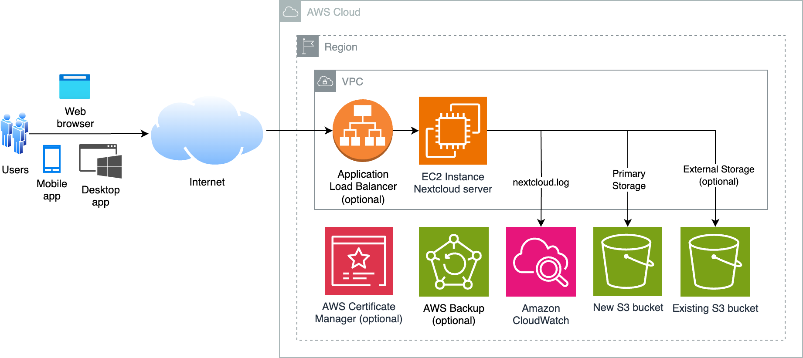

# Nextcloud-Server

[AWS CloudFormation](https://aws.amazon.com/cloudformation/) template that provisions an EC2 instance running [Nextcloud Files](https://nextcloud.com/files/) file synchronization and sharing server, with a new [Amazon S3](https://aws.amazon.com/s3/) bucket as primary storage and [AWS Backup](https://aws.amazon.com/s3/) for data protection. Includes option to mount existing S3 bucket.

## Notice

Although this repository is released under the [MIT-0](LICENSE) license, its CloudFormation template uses features from [Nextcloud](https://github.com/nextcloud/server) project. Nextcloud project's licensing includes the [AGPL](https://github.com/nextcloud/server?tab=AGPL-3.0-1-ov-file) license.

The template offers the option to install [Webmin](https://github.com/webmin/webmin) which is released under [BSD-3-Clause](https://github.com/webmin/webmin?tab=BSD-3-Clause-1-ov-file) license.

Usage of template indicates acceptance of license agreements of all software that is installed in the EC2 instance. 

## About CloudFormation template

### Installation method

This template uses [Nextcloud .tar archive](https://nextcloud.com/install/) to install Nextcloud, which is a [recommended installation
method](https://docs.nextcloud.com/server/latest/admin_manual/installation/source_installation.html).

### Architecture diagram



*Solution can be deployed in a private subnet for internal only use.*

### Requirements

Besides Nextcloud [system requirements](https://docs.nextcloud.com/server/latest/admin_manual/installation/system_requirements.html),

- EC2 instance must be provisioned in a subnet with outbound IPv4 internet connectivity. 
- To use [Application Load Balancer (ALB)](https://aws.amazon.com/elasticloadbalancing/application-load-balancer/) with HTTPS, either [request a public certificate](https://docs.aws.amazon.com/acm/latest/userguide/acm-public-certificates.html) or [import a certificate](https://docs.aws.amazon.com/acm/latest/userguide/import-certificate.html) into [AWS Certificate Manager](https://aws.amazon.com/certificate-manager/)

## Deploying using CloudFormation console

Download [UbuntuLinux-Nextcloud.yaml](UbuntuLinux-Nextcloud.yaml) file, and login to AWS [CloudFormation console](https://console.aws.amazon.com/cloudformation/home#/stacks/create/template). 

Start the [Create Stack wizard](https://docs.aws.amazon.com/AWSCloudFormation/latest/UserGuide/cfn-console-create-stack.html#cfn-using-console-initiating-stack-creation) by choosing **Create Stack**. [Select stack template](https://docs.aws.amazon.com/AWSCloudFormation/latest/UserGuide/cfn-using-console-create-stack-template.html) by selecting **Upload a template file**, **Choose File**, select your `.yaml` file and click **Next**. Enter a **Stack name** and specify parameters values. 

### Parameter options

EC2 instance

- `ec2Name`: EC2 instance name 
- `ec2KeyPair`: [EC2 key pair](https://docs.aws.amazon.com/AWSEC2/latest/UserGuide/ec2-key-pairs.html) name. [Create key pair](https://docs.aws.amazon.com/AWSEC2/latest/UserGuide/create-key-pairs.html) if necessary
- `osVersion`: operating system version and processor architecture. Default architecture is [Graviton](https://aws.amazon.com/ec2/graviton/) arm64
- `instanceType`: EC2 [instance type](https://aws.amazon.com/ec2/instance-types/). Do ensure type matches selected processor architecture. Default is `m6g.xlarge`. 
- `ec2TerminationProtection`: enable [EC2 termination protection](https://docs.aws.amazon.com/AWSEC2/latest/UserGuide/Using_ChangingDisableAPITermination.html) to prevent accidental deletion. Default is `Yes`

*To use Nextcloud [Artificial Intelligence](https://docs.nextcloud.com/server/stable/admin_manual/ai/index.html) features, select x86_64 `osVersion` and x86_64 [NVIDIA GPU](https://docs.aws.amazon.com/AWSEC2/latest/UserGuide/install-nvidia-driver.html#nvidia-driver-instance-type) `instancetype`. Template will [install](https://repost.aws/articles/ARWGxLArMBQ4y1MKoSHTq3gQ/install-nvidia-gpu-driver-cuda-toolkit-nvidia-container-toolkit-on-amazon-ec2-instances-running-ubuntu-linux) required NVIDIA GPU drivers and software*

EC2 Network

- `vpcID`: [VPC](https://docs.aws.amazon.com/vpc/latest/userguide/what-is-amazon-vpc.html) with internet connectivity. Select [default VPC](https://docs.aws.amazon.com/vpc/latest/userguide/default-vpc.html) if unsure
- `subnetID`: subnet with internet connectivity. Select subnet in default VPC if unsure
- `displayPublicIP`: select `No` if your EC2 instance will not receive [public IP address](https://docs.aws.amazon.com/AWSEC2/latest/UserGuide/using-instance-addressing.html#concepts-public-addresses). EC2 private IP will be displayed in CloudFormation Outputs section instead. Default is `Yes`
- `assignStaticIP`: associates a static public IPv4 address using [Elastic IP address](https://docs.aws.amazon.com/AWSEC2/latest/UserGuide/elastic-ip-addresses-eip.html). Default is `Yes`

Application Load Balancer (ALB)

- `enableALB`: deploy [Application Load Balancer](https://aws.amazon.com/elasticloadbalancing/application-load-balancer/) with EC2 instance as target. Default is `No`
- `albScheme`: either `internet-facing` or `internal`. An internet-facing load balancer routes requests from clients to targets over the internet. An internal load balancer routes requests to targets using private IP addresses. Default is `internet-facing`
- `albIpAddressType`: [IP address type](https://docs.aws.amazon.com/elasticloadbalancing/latest/application/application-load-balancers.html#ip-address-type), either `IPv4`, `IPv4-and-IPv6` or `IPv6`. Default is `IPv4`
- `albSubnets`: subnets for ALB. Select at least 2 AZ subnets in EC2 VPC**
  
** *Select a subnet even if `enableALB` is `No`*

ALB HTTPS listener

*Below options only apply if `enableALB` is `Yes`*

- `albCertificateArn`: Certificate ARN for ALB [HTTPS listener](https://docs.aws.amazon.com/elasticloadbalancing/latest/application/create-https-listener.html). Leave blank not to create HTTPS listener
- `albSecurityPolicy`: [Security policy](https://docs.aws.amazon.com/elasticloadbalancing/latest/application/create-https-listener.html#describe-ssl-policies) for HTTPS listener. Default is `ELBSecurityPolicy-TLS13-1-2-2021-06`
- `albRedirectHTTPtoHTTPS`: option to redirect HTTP requests to HTTPS. Default is `Yes`
- `albHstsHeaderValue`: [HSTS (HTTP Strict Transport Security)](https://cheatsheetseries.owasp.org/cheatsheets/HTTP_Strict_Transport_Security_Cheat_Sheet.html) response header value to send. Do not specify a value not to send HSTS header. Default is `max-age=31536000; includeSubDomains`

EC2 Remote Administration

- `ingressIPv4`: allowed IPv4 source prefix to remote administration services, e.g. `1.2.3.4/32`. You can get your source IP from [https://checkip.amazonaws.com](https://checkip.amazonaws.com). Use `127.0.0.1/32` to block incoming access from network. Default is `0.0.0.0/0`. 
- `ingressIPv6`: allowed IPv6 source prefix to remote administration services. Use `::1/128` to block all incoming IPv6 access. Default is `::/0`
- `allowSSHport`: allow inbound SSH. Option does not affect [EC2 Instance Connect](https://aws.amazon.com/blogs/compute/new-using-amazon-ec2-instance-connect-for-ssh-access-to-your-ec2-instances/) access. Default is `No`
- `installDCV`: install graphical desktop environment and [Amazon DCV](https://aws.amazon.com/hpc/dcv/) server. Default is `No`
- `installWebmin`: install [Webmin](https://webmin.com/) web-based system administration tool. Default is `No`

*SSH, DCV and Webmin inbound access are restricted to `ingressIPv4` and `ingressIPv6` IP prefixes.*

Nextcloud

- `adminUserName`: Nextcloud admin username. Default is `admin`
- `phpVersion`: PHP version to install. Uses [Ondřej Surý](https://deb.sury.org/)'s [ppa:ondrej/php](https://launchpad.net/~ondrej/+archive/ubuntu/php/) repository
- `databaseOption`: `MariaDB` or `MySQL`. Default is `MariaDB`
- `r53ZoneID` (optional):  [Amazon Route 53](https://aws.amazon.com/route53/) hosted zone ID to grant access for use with Certbot [certbot-dns-route53](#option-2-using-certbot-certbot-dns-route53-plugin) DNS plugin.  Default is `*` which grants access to all Route 53 zones in your AWS account. Permission is restricted to **_acme-challenge.\*** TXT DNS records using [resource record set permissions](https://docs.aws.amazon.com/Route53/latest/DeveloperGuide/resource-record-sets-permissions.html)

S3

- `s3StorageClass`: [S3 storage class](https://docs.aws.amazon.com/AmazonS3/latest/userguide/storage-class-intro.html) for files in primary storage. Default is [`INTELLIGENT_TIERING`](https://docs.aws.amazon.com/AmazonS3/latest/userguide/intelligent-tiering.html)
- `enableS3bucketLogging`: enable [S3 server access logging](https://docs.aws.amazon.com/AmazonS3/latest/userguide/enable-server-access-logging.html). Default is `No`

S3 External Storage

- `externalS3Bucket` (optional): option to mount existing S3 bucket within Nextcloud as [external storage](https://docs.nextcloud.com/server/latest/admin_manual/configuration_files/external_storage_configuration_gui.html). Specify bucket name in your account
- `externalS3BucketRegion`: [AWS Region](https://docs.aws.amazon.com/AWSEC2/latest/UserGuide/using-regions-availability-zones.html#concepts-regions) where `externalS3Bucket` is located
- `externalS3BucketStorageClass`: [S3 storage class](https://docs.aws.amazon.com/AmazonS3/latest/userguide/storage-class-intro.html)

EBS

- `volumeSize`: [Amazon EBS](https://docs.aws.amazon.com/AWSEC2/latest/UserGuide/AmazonEBS.html) volume size
- `volumeType`: [EBS General Purpose Volume](https://aws.amazon.com/ebs/general-purpose/) type

AWS Backup

- `backupResource`: option to backup EC2 instance, S3 bucket, existing S3 bucket mounted as external storage, or none. [Versioning](https://docs.aws.amazon.com/AmazonS3/latest/userguide/Versioning.html) must be enabled on S3 bucket mounted as external storage before [AWS Backup](https://docs.aws.amazon.com/AmazonS3/latest/userguide/backup-for-s3.html) can back it up. Default is `EC2-and-S3` 
- `scheduleExpression`: CRON expression specifying when AWS Backup initiates a backup job. Default is `cron(0 1 ? * * *)`
- `scheduleExpressionTimezone`: timezone in which the schedule expression is set. Default is `Etc/UTC`
- `deleteAfterDays`: number of days after creation that a recovery point is deleted. Default is `35` days

It may take more than 30 minutes to provision the entire stack. After your stack has been successfully created, its status changes to **CREATE_COMPLETE**.

## CloudFormation Outputs
The following are available in **Outputs** section

- `EC2console`: EC2 console URL link to your EC2 instance
- `EC2instanceID` : EC2 Instance ID
- `EC2instanceConnect`: [EC2 Instance Connect](https://aws.amazon.com/blogs/compute/new-using-amazon-ec2-instance-connect-for-ssh-access-to-your-ec2-instances/) URL link. Functionality is only available under [certain conditions](https://docs.aws.amazon.com/AWSEC2/latest/UserGuide/ec2-instance-connect-prerequisites.html)
- `EC2iamRole`: [IAM role](https://docs.aws.amazon.com/IAM/latest/UserGuide/id_roles_use_switch-role-ec2.html) URL link to manage permissions
- `NextcloudLogUrl`: Cloudwatch [log group](https://docs.aws.amazon.com/AmazonCloudWatch/latest/logs/Working-with-log-groups-and-streams.html) with the contents of [nextcloud\.log](https://docs.nextcloud.com/server/stable/admin_manual/configuration_server/logging_configuration.html)
- `SetPasswordCmd`: command to [set Nextcloud admin password](#nextcloud-admin-user-password). Default password is `EC2instanceID` value
- `SSMsessionManager` or `SSMsessionManagerDCV`: [SSM Session Manager](https://aws.amazon.com/blogs/aws/new-session-manager/) URL link
- `WebUrl`: EC2 web server URL link

If `installDCV` is `Yes`

- `DCVwebConsole`: DCV web browser console URL link. Login as `ubuntu`. Default password is `EC2instanceID` value

If `installWebmin` is `Yes`

- `WebminUrl`: Webmin URL link. Set the root password by running `sudo passwd root` from `EC2instanceConnect`, `SSMsessionManager` or SSH session first

If `enableALB` is `Yes`

- `AlbConsole`: ALB console URL
- `AlbDnsName`: ALB domain name. Create a DNS CNAME or [Route 53 alias](https://docs.aws.amazon.com/Route53/latest/DeveloperGuide/resource-record-sets-choosing-alias-non-alias.html) to ALB domain name especially if you are using HTTPS listener

## Using Nextcloud

### Login to Nextcloud

Login to your Nextcloud application using `WebUrl` or `AlbUrl` link. Default password is EC2 Instance ID.

https://github.com/user-attachments/assets/1026415b-eef6-4968-8e12-e1cb925afc30

### Obtaining certificate for HTTPS using Certbot

The EC2 instance uses a self-signed certificate for HTTPS. You can use [Certbot](https://certbot.eff.org/pages/about) to automatically obtain and install [Let's Encrypt](https://letsencrypt.org/) certificate on your web server.

#### Prerequisites

Ensure you have a domain name whose DNS entry resolves to your EC2 instance IP address. If you do not have a domain, you can [register a new domain](https://docs.aws.amazon.com/Route53/latest/DeveloperGuide/domain-register.html#domain-register-procedure-section) using [Amazon Route 53](https://aws.amazon.com/route53/) and [create a DNS A record](https://docs.aws.amazon.com/Route53/latest/DeveloperGuide/resource-record-sets-creating.html).

#### Option 1: Using Certbot Apache plugin

This option requires your domain name to resolve to your EC2 instance *public internet* IP address. From terminal, run the below command

```
sudo certbot --apache
```

#### Option 2: Using Certbot certbot-dns-route53 plugin

The [certbot-dns-route53](https://certbot-dns-route53.readthedocs.io/en/stable/) option requires your DNS to be hosted by Route 53. It supports wildcard certificates and domain names that resolve to private IP addresses. Ensure that Route 53 zone access is granted by specifying `r53ZoneID` value.  From terminal, run the below command

```
sudo certbot --dns-route53 --installer apache
```

Follow instructions to have Certbot request and install certificate on your web server. Refer to Certbot site for [help](https://certbot.eff.org/pages/help) with this tool.  

#### Configure HSTS on EC2 instance

To configure [HTTP Strict Transport Security (HSTS)](https://en.wikipedia.org/wiki/HTTP_Strict_Transport_Security) headers, edit `*ssl.conf` file in `/etc/apache2/sites-available/` folder and add the following text between `<VirtualHost>` and `</VirtualHost>` rows.

```
    <IfModule mod_headers.c>
      Header always set Strict-Transport-Security "max-age=15552000; includeSubDomains"
    </IfModule>
```

Verify Apache configuration

```
sudo apachetl -t
```

Reload Apache server

``` 
sudo systemctl reload apache2
```

### Troubleshooting

To troubleshoot any installation issue, you can view contents of the following log files
- `/var/log/cloud-init-output.log`
- `/var/log/install-cfn-helper.log`
- `/var/log/install-sw.log`
- `/var/log/install-dcv.log`
- `/var/log/install-nextcloud.log`

## Managing and using Nextcloud

### Sending email

Nextcloud supports [email server](https://docs.nextcloud.com/server/latest/admin_manual/configuration_server/email_configuration.html) for password reset and activity notifications. You can configure Nextcloud to use [external SMTP server](https://docs.nextcloud.com/server/latest/admin_manual/configuration_server/email_configuration.html#configuring-an-smtp-server) (e.g. [Amazon SES](https://docs.aws.amazon.com/ses/latest/dg/send-email-smtp.html)), or [sendmail](https://docs.nextcloud.com/server/latest/admin_manual/configuration_server/email_configuration.html#configuring-sendmail-qmail).

When configuring external SMTP server, use 465, 587 or supported port number that is not 25. Amazon EC2 [restricts](https://docs.aws.amazon.com/AWSEC2/latest/UserGuide/ec2-resource-limits.html#port-25-throttle) email sending using port 25 on all instances by default. You can request that this restriction be removed if you are using port 25 for external SMTP server or sendmail. Refer to [How do I remove the restriction on port 25 from my Amazon EC2 instance or Lambda function?](https://repost.aws/knowledge-center/ec2-port-25-throttle) for more information.

### Using the occ command

The [occ](https://docs.nextcloud.com/server/latest/admin_manual/configuration_server/occ_command.html) command is Nextcloud's command-line interface. It is used to perform common server operations such as installing and upgrading Nextcloud, and must be run as HTTP user, i.e. `sudo -u www-data php /var/www/html/occ`. On the EC2 instance, you can use the alias `occ`.

### Mounting external storage services as external storage

Nextcloud [external storage](https://docs.nextcloud.com/server/latest/admin_manual/configuration_files/external_storage_configuration_gui.html) feature enables you to mount external storage services including Windows file servers and S3 buckets as secondary storage devices. Refer to [NextCloud documentation](https://docs.nextcloud.com/server/latest/admin_manual/configuration_files/external_storage_configuration_gui.html#available-storage-backends) for details.

### Client app downloads

Desktop and mobile applications download links are available from [Nextcloud Install](https://nextcloud.com/install/#install-clients) page.

### Documentation

[Administration guide](https://docs.nextcloud.com/server/stable/admin_manual/) and [user manual](https://docs.nextcloud.com/server/stable/user_manual/en/) are available from Nextcloud [documentation site](https://docs.nextcloud.com/). 

### Further information

Nextcloud is mentioned by the following blog posts

- [Scale your Nextcloud with Storage on Amazon Simple Storage Service (Amazon S3)](https://aws.amazon.com/blogs/opensource/scale-your-nextcloud-with-storage-on-amazon-simple-storage-service-amazon-s3/)
- [Advanced Nextcloud Workflows with Amazon Simple Storage Service (Amazon S3)](https://aws.amazon.com/blogs/opensource/advanced-nextcloud-workflows-with-storage-on-amazon-simple-storage-service-amazon-s3-2/)

## Data protection

### S3 primary storage

Amazon S3 is used to provide almost unlimited, cost-effective and [durable](https://aws.amazon.com/s3/faqs/#Durability_.26_Data_Protection) storage over EBS. Using S3 as [primary storage](https://docs.nextcloud.com/server/latest/admin_manual/configuration_files/primary_storage.html) provides [performance benefits](
https://docs.nextcloud.com/server/latest/admin_manual/configuration_files/primary_storage.html#performance-implications) over S3 as [external storage](https://docs.nextcloud.com/server/latest/admin_manual/configuration_files/external_storage/amazons3.html), including support for [large file uploads](https://docs.nextcloud.com/server/latest/admin_manual/configuration_files/big_file_upload_configuration.html#large-file-upload-on-object-storage).

Note that files are not accessible outside of NextCloud as all metadata (filenames, directory structures, etc) is stored in MariaDB/MySQL database on EC2 instance. The S3 bucket holds the file content by unique identifier and *not* filename. This has implications for [data backup and recovery](https://docs.nextcloud.com/server/latest/admin_manual/configuration_files/primary_storage.html#data-backup-and-recovery-implications), and it is important to backup both EC2 instance and S3 bucket data. 

### Restoring from backup

If you enable AWS Backup, you can restore your [EC2 instance](https://docs.aws.amazon.com/aws-backup/latest/devguide/restoring-ec2.html) and [S3 data](https://docs.aws.amazon.com/aws-backup/latest/devguide/restoring-s3.html) from recovery points (backups) in your [backup vault](https://docs.aws.amazon.com/aws-backup/latest/devguide/vaults.html). The CloudFormation template creates an IAM role that grants AWS Backup permission to restore your backups. Role name can be located in your CoudFormation stack Resources section where Logical ID is `backupRestoreRole`.

### Recovery points protection

To protect recovery points from inadvertent or malicious deletions, you can enable [AWS Backup Vault Lock](https://docs.aws.amazon.com/aws-backup/latest/devguide/vault-lock.html) in compliance mode to provide immutable WORM (write-once, read-many) backups. Vaults that are locked in compliance mode *cannot be deleted* once the cooling-off period ("grace time") expires if any recovery points are in the vault. Refer to [Protecting data with AWS Backup Vault Lock](https://aws.amazon.com/blogs/storage/protecting-data-with-aws-backup-vault-lock/) for more information. 

### Filter IAM policy source IP

Nextcloud server uses [EC2 IAM role](https://docs.aws.amazon.com/AWSEC2/latest/UserGuide/iam-roles-for-amazon-ec2.html) for S3 primary storage access. If instance has Elastic IP (`assignStaticIP`) or is using [NAT gateway](https://docs.aws.amazon.com/vpc/latest/userguide/vpc-nat-gateway.html), you can limit IAM role access to its public IP address. This ensures that even when the session credentials are stolen, an attacker cannot directly use it to access files from his own address.

Use `ec2IamRole` link to modify EC2 role inline permission. Change `aws:SourceIp` value from `0.0.0.0/0` to your EC2 instance or NAT gateway Elastic IP address. If IP address is 1.2.3.4, your updated policy may look similar to below

```
{
  "Version": "2012-10-17",
  "Statement": [
    {
      "Condition": {
        "IpAddress": {
          "aws:SourceIp": "1.2.3.4/32"
        }
      },
      "Action": [
        "s3:*"
      ],
      "Resource": [
        "arn:aws:s3:::nextcloud-s3bucket-8ohvkk9vzv2f",
        "arn:aws:s3:::nextcloud-s3bucket-8ohvkk9vzv2f/*"
      ],
      "Effect": "Allow"
    }
  ]
}
```

An [IAM user](https://docs.aws.amazon.com/IAM/latest/UserGuide/id_users.html) with attached [policy](https://docs.aws.amazon.com/IAM/latest/UserGuide/access_policies_managed-vs-inline.html#inline-policies) is used for S3 external storage access. Using EC2 IAM role for external storage currently generates errors in nextcloud.log. ([Issue #46400](https://github.com/nextcloud/server/issues/46400)) The IAM user can be located in CloudFormation **Resources** section where `Logical ID` is **iamUser**, and you may want to configure the associated policy `aws:SourceIp` value. You can modify its permission to mount additional S3 buckets; the security credentials are located in `/root/.nextcloud-credentials` on EC2 instance. 

### Sensitive data protection

To strengthen data security posture, you can enable [Amazon Macie](https://aws.amazon.com/macie/) to automate discovery of sensitive data that is uploaded to your S3 bucket

## Securing EC2 instance

To futher secure your EC2 instance, you may want to

- Restrict remote administration access to your IP address only (`ingressIPv4` and `ingressIPv6`)
- Disable SSH access from public internet (`allowSSHport`)
  - Use [EC2 Instance Connect](https://docs.aws.amazon.com/AWSEC2/latest/UserGuide/ec2-instance-connect-methods.html#ec2-instance-connect-connecting-console) or [SSM Session Manager](https://docs.aws.amazon.com/systems-manager/latest/userguide/session-manager-working-with-sessions-start.html#start-ec2-console) for in-browser terminal access, or 
  - Start a session using [AWS CLI](https://docs.aws.amazon.com/systems-manager/latest/userguide/session-manager-working-with-sessions-start.html#sessions-start-cli) or [SSH](https://docs.aws.amazon.com/systems-manager/latest/userguide/session-manager-working-with-sessions-start.html#sessions-start-ssh) with [Session Manager plugin for the AWS CLI](https://docs.aws.amazon.com/systems-manager/latest/userguide/session-manager-working-with-install-plugin.html)
- For DCV (`installDCV`)
  - Use [native clients](https://www.amazondcv.com/) for remote access, and disable web browser client by removing `nice-dcv-web-viewer` package
- Deploy EC2 instance in a private subnet
  - Use [Application Load Balancer](https://aws.amazon.com/elasticloadbalancing/application-load-balancer/) and [AWS WAF](https://aws.amazon.com/waf/) to [protect your EC2 instance](https://repost.aws/knowledge-center/waf-protect-ec2-instance)
  - Use [AWS Certificate Manager](https://aws.amazon.com/certificate-manager/) to [request a public HTTPS certificate](https://docs.aws.amazon.com/acm/latest/userguide/gs-acm-request-public.html) and [associate it](https://repost.aws/knowledge-center/associate-acm-certificate-alb-nlb) with your Application Load Balancer
- Use AWS Backup (`backupResource`).
  - Enable [AWS Backup Vault Lock](https://aws.amazon.com/blogs/storage/enhance-the-security-posture-of-your-backups-with-aws-backup-vault-lock/) to prevent your backups from accidental or malicious deletion, and for [protection from ransomware](https://aws.amazon.com/blogs/security/updated-ebook-protecting-your-aws-environment-from-ransomware/)
- Enable [Amazon Inspector](https://aws.amazon.com/inspector/) to [scan EC2 instance](https://docs.aws.amazon.com/inspector/latest/user/scanning-ec2.html) for software vulnerabilities and unintended network exposure.
- Enable [Amazon GuardDuty](https://aws.amazon.com/guardduty/) security monitoring service with [Runtime Protection](https://docs.aws.amazon.com/guardduty/latest/ug/how-runtime-monitoring-works-ec2.html) and [Malware Protection for EC2](https://docs.aws.amazon.com/guardduty/latest/ug/malware-protection.html)

## Clean Up

To remove created resources,

- [Empty](https://docs.aws.amazon.com/AmazonS3/latest/userguide/empty-bucket.html) created S3 bucket(s)
- [Delete](https://docs.aws.amazon.com/aws-backup/latest/devguide/deleting-backups.html) any recovery points in created backup vault
- [Disable](https://docs.aws.amazon.com/AWSEC2/latest/UserGuide/Using_ChangingDisableAPITermination.html) EC2 instance termination protection (if enabled)
- [Delete](https://docs.aws.amazon.com/AWSCloudFormation/latest/UserGuide/cfn-console-delete-stack.html) CloudFormation stack

## Security

See [CONTRIBUTING](CONTRIBUTING.md#security-issue-notifications) for more information.

## License

This library is licensed under the MIT-0 License. See the LICENSE file.
